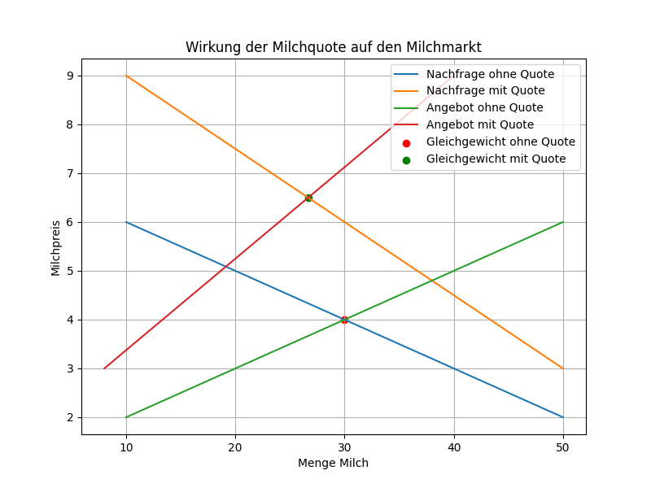

# Milchquote

Im Jahre 1984 führte die damalige Europäische Wirtschaftsgemeinschaft eine Quotenregelung ein, um die Milchproduktion in den Mitgliedstaaten zu beschränken. Grundlage für die Zuteilung der Milchreferenzmenge, auch Milchquote oder Milchkontingent genannt, war die Milchanlieferungsmenge des Milchwirtschaftsjahres 1983. 

## Grafische Darstellung

Wirkung einer staatlich festgesetzten Milchquote auf dem Milchmarkt grafisch:

